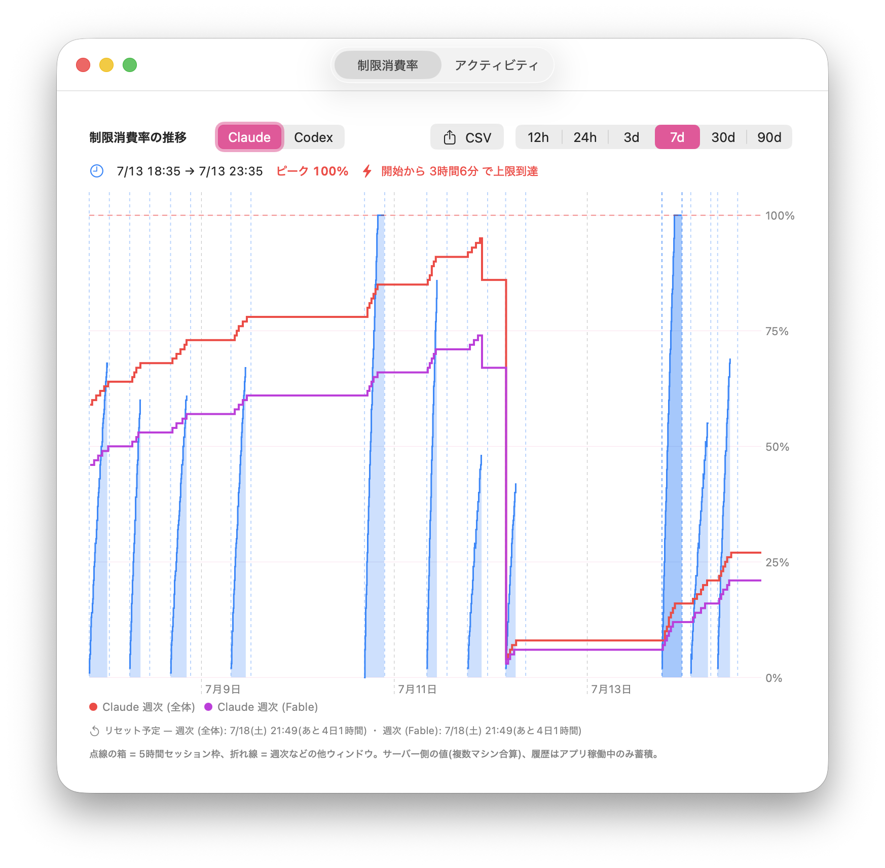
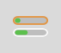
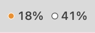
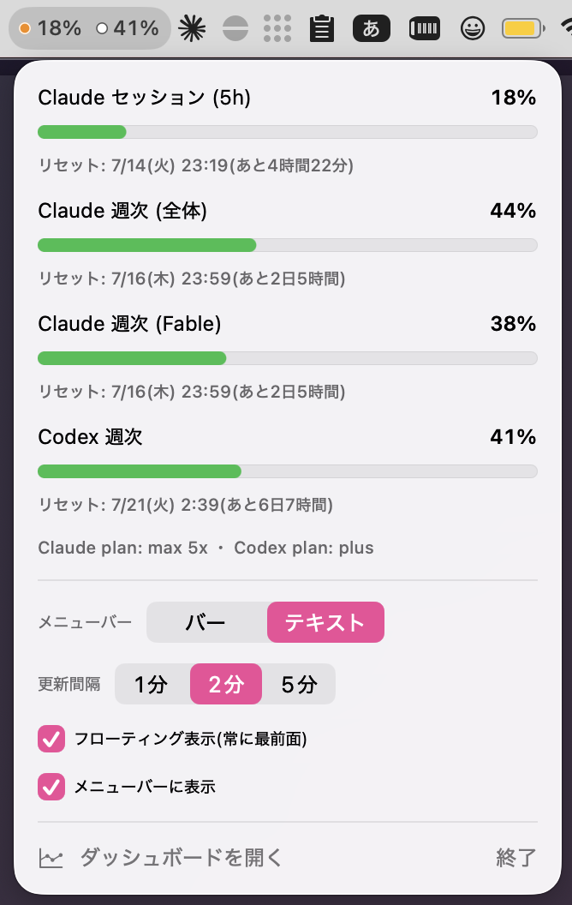
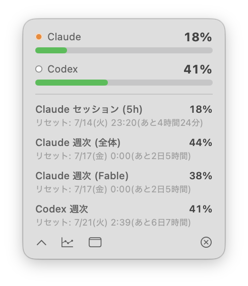
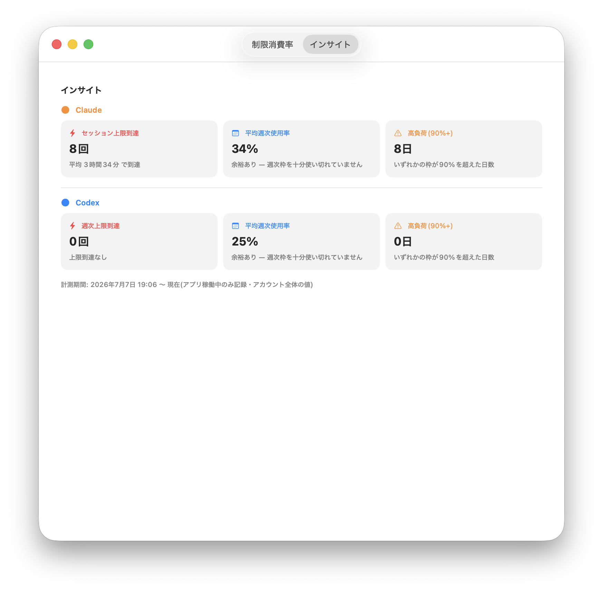

# CCCX Usage Monitor

**Claude Code と OpenAI Codex CLI の利用制限を、Mac のメニューバーで常時監視。**

> **CCCX** = **CC**(Claude Code)+ **CX**(Codex)

5時間セッション・週次などの制限ウィンドウの消費率を60秒ごとに取得してメニューバーに表示し、
推移グラフ・リセット予定時刻・利用傾向の分析をアプリ内ダッシュボードで確認できます。

表示する数値はすべて **Anthropic / OpenAI のサーバーが返すアカウント全体の値**です。
複数マシンで使っていても正確で、ローカルログからの推測ではありません。



## 特徴

### メニューバー

- **ミニバー2段**(上段: Claude=オレンジ枠 / 下段: Codex=白枠、色で危険度: 緑 <60% / 黄 <85% / 赤 ≥85%)
- または**色付きドット+数値**(`● 74%  ○ 32%`)のテキスト表示
- クリックでポップオーバー: 全ウィンドウのゲージ、**リセット予定時刻(絶対時刻+残り時間)**、プラン表示(`Claude plan: max 5x ・ Codex plan: plus`)、各種設定
- メニューバー自体を**非表示**にしてHUDだけで運用することも可能

<p>
  
  
</p>


### フローティングHUD

- 常に最前面の半透明パネル。**全Space・フルスクリーンアプリの上でも表示**、ドラッグで自由に配置(位置記憶)
- 下部ボタン: ダッシュボードを開く / メニューバー表示切替 / 閉じる
- シェブロン(⌄)で展開すると**全ウィンドウの%とリセット日時**を一覧表示



### ダッシュボード

- **制限消費率**: 5時間セッション枠を点線の箱+面グラフで可視化。ホバーで「開始→終了・ピーク%・上限到達までの時間」。週次などは折れ線で重ね描き。Claude/Codex 切替、期間 12h〜90d、CSV 書き出し
- **アクティビティ**: GitHub 風の日別ヒートマップ。1マスを上下に分割し、**上段 = Claude、下段 = Codex を同時表示**。色の濃さ = その日に消費した枠の量(%ポイント換算)。**アカウント全体の値ベースなので、他のマシンや Linux サーバでの利用も含まれます**。同じタブの下部にインサイト(上限到達回数・平均到達時間・平均週次使用率・高負荷日数を Claude / Codex 別に自動集計)



*(スクリーンショットのグラフはデモデータです)*

### 表示の正確性へのこだわり

- **60秒ごとの同期**(間隔は 1/2/5分 で変更可)。429 時はサーバーの `Retry-After` を尊重して自動バックオフ
- **期限切れ補正**: ウィンドウのリセット時刻を過ぎたら、取得済みの古い%をそのまま出さず 0% として表示(「リセット済み — 次の取得で更新」と明示)
- リセット時刻は常にサーバー返却値をそのまま表示 — 障害後の臨時リセットや不規則な週次リセットにも1分以内に追従
- 取得失敗時は最後の正常値+⚠で明示(データが10分以内なら⚠は出さない)
- Claude Code 未ログイン / Codex 未インストールの環境では、そのサービスを自動で非表示(エラー扱いしない)。**片方だけの利用でもOK**

## 必要環境

- macOS 14 (Sonoma) 以降、Apple Silicon
- Xcode Command Line Tools(Swift 6 系。`xcode-select --install`)
- Claude Code(サブスクでログイン済み)/ Codex CLI(ChatGPT でログイン済み)— どちらか片方だけでも可
  - Claude 側の認証は **Claude Code のログイン情報**(CLI または VS Code 等の拡張)を使います。claude.ai やデスクトップアプリだけの利用では認証情報が無いため、一度 `claude` にログインしてください
  - 表示される使用率%は Claude Code 限定ではなく、**claude.ai のチャットやモバイルも含むアカウント全体の消費率**です(制限はClaude全体で共有のため)

## インストール

```bash
git clone https://github.com/Rtm2301/CCCX-Usage-Monitor.git
cd CCCX-Usage-Monitor
Scripts/build-app.sh --install
open "/Applications/CCCX Usage Monitor.app"
```

- 外部依存ゼロ・swiftc 直接コンパイルなので数十秒でビルドできます(`--install` なしなら `dist/` に出力)
- **初回起動時に Keychain の許可ダイアログが1回出ます → 「常に許可」を選択**(Apple 署名済みの `/usr/bin/security` 経由なので再ビルド後も許可が持続します)
- ログイン時に自動起動: システム設定 → 一般 → ログイン項目 に `CCCX Usage Monitor.app` を追加

## 仕組み(データソース)

| データ | 取得方法 | 精度 |
|---|---|---|
| Claude 制限%(セッション/週次/モデル別) | Keychain の `Claude Code-credentials` から OAuth トークンを読み、`GET https://api.anthropic.com/api/oauth/usage`(ヘッダ `anthropic-beta: oauth-2025-04-20`)の `limits[]` をデコード | アカウント全体・ライブ |
| Claude プラン | 同 Keychain の `subscriptionType` + `rateLimitTier` | — |
| Codex 制限% | `codex app-server` を子プロセス常駐させ JSON-RPC `account/rateLimits/read` を毎分実行。不可時は `~/.codex/sessions/**/rollout-*.jsonl` の最終値にフォールバック(黄バナー表示) | アカウント全体・ライブ |
| 推移グラフ | 上記を毎分記録した自前の蓄積(`~/Library/Application Support/CCCX Usage Monitor/snapshots/`、90日保持)。**履歴はアプリ稼働中のみ**蓄積 | アカウント全体 |

トークン数や金額ベースの表示は意図的にありません。API は使用率%しか返さず、トークン/コストを
アカウント全体で正確に出す方法が存在しないためです(ローカルログ集計だと「そのMacの分だけ」になり誤解を招く)。

`api/oauth/usage` は**非公開エンドポイント**のため、Anthropic 側の変更で動かなくなる可能性があります。
その場合も最後の正常値+⚠表示に退避し、クラッシュはしません。

## トラブルシューティング

| 症状 | 対処 |
|---|---|
| `● —⚠` が出続ける | Claude Code を一度開く(トークンは Claude Code 自身が更新)。理由はポップオーバーのバナーに表示されます |
| Codex が黄バナー(フォールバック) | `USAGEBAR_CODEX_BIN=/path/to/codex` で codex の場所を明示(Homebrew 標準パスは自動探索済み) |
| 429(レート制限)が頻発 | 他の使用量監視アプリとの併用が原因。どちらかを止めるか、更新間隔を2〜5分に |
| ビルドで SDK 不整合エラー | CLT が壊れています: `sudo rm -rf /Library/Developer/CommandLineTools && xcode-select --install` |
| メニューバーもHUDも消えた | 起きません(相互ガードあり)。万一の場合も再起動でメニューバーが復活します |

## プロジェクト構成

```
Scripts/build-app.sh              # swiftc → .app 組み立て → ad-hoc 署名 → (--install)
Support/Info.plist                # LSUIElement=true(常駐アプリ)
Sources/CCCXUsageMonitor/
  CCCXUsageMonitorApp.swift               # @main: MenuBarExtra(表示/非表示対応)
  AppState.swift                  # ポーリング・状態・履歴・未設定判定・締め出しガード
  Models/LimitModels.swift        # LimitSnapshot(期限切れ補正 effectivePercent)
  Services/
    ClaudeAuth.swift              # Keychain → トークン+プラン
    ClaudeLimitsClient.swift      # oauth/usage(Retry-After 対応・防御的デコード)
    CodexAppServerClient.swift    # codex app-server 常駐 JSON-RPC クライアント
    CodexLimitsReader.swift       # rollout ファイルのフォールバック
    SnapshotStore.swift           # 制限スナップショットの JSONL 永続化
  Views/                          # ポップオーバー / メニューバー描画 / HUD / ダッシュボード
```


## 制限事項

- 制限%の**推移**はアプリが動いている間しか記録されません(APIが現在値のみ返すため)
- ad-hoc 署名なので配布物はありません(各自がローカルでビルドする前提)。Gatekeeper 警告を避けたい場合は自分の Developer ID で `codesign` してください
